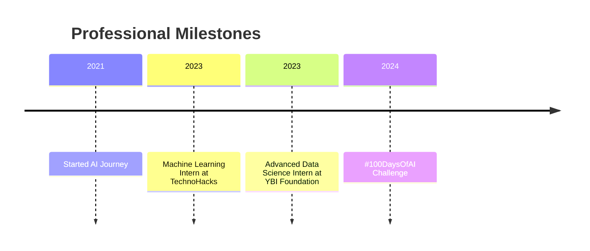

# 🌟 Mahesh Ketam | AI Innovator & Machine Learning Maestro

  
  
  

    
    
    
  

## 💡 Mission Statement

> **Transforming complex data into intelligent solutions, one model at a time. Committed to pushing the boundaries of AI and machine learning to solve real-world challenges.**

## 🌟 About Me

<table>
  <tr>
    <td width="60%">
      
As an AI professional with 3 years of hands-on experience, I'm passionate about developing cutting-edge machine learning models that drive innovation. My journey is fueled by a relentless curiosity to explore the infinite potential of artificial intelligence.

    </td>
    <td width="40%">
      <h3>🎓 Education</h3>
      <ul>
        <li>Bachelor's in Computer Science</li>
        <li>Jayamukhi Institute of Technological Sciences</li>
      </ul>
    </td>
  </tr>
</table>

## 🚀 Quick Glimpse

<table>
  <tr>
    <td width="50%">
      <h3>🎯 Mission</h3>
      
Transforming complex data into intelligent solutions, bridging the gap between artificial intelligence and real-world challenges.

    </td>
    <td width="50%">
      <h3>📊 At a Glance</h3>
      <ul>
        <li>🏆 3+ Years in AI/ML</li>
        <li>🎓 Computer Science Graduate</li>
        <li>🌐 Full-Stack AI Enthusiast</li>
      </ul>
    </td>
  </tr>
</table>

### 🔬 Skill Proficiency

| Skill Category        | Proficiency          | Highlights                                                                    |
| --------------------- | -------------------- | ----------------------------------------------------------------------------- |
| **Machine Learning**  | ████████████████ 95% | Supervised & Unsupervised Learning, Model Evaluation, Feature Engineering     |
| **Deep Learning**     | ███████████████ 90%  | CNNs, RNNs, ANN, Transfer Learning, PyTorch, TensorFlow                       |
| **NLP & LLMs**        | ███████████████ 90%  | Transformers, LangChain, RAG, Embeddings, Prompt Engineering                  |
| **Data Science**      | ██████████████ 85%   | EDA, Statistical Analysis, Data Cleaning, Visualization (Matplotlib, Seaborn) |
| **Agentic AI**        | ████████████ 80%     | LangGraph, Reflection Agents, Custom Toolchains                               |
| **AI Deployment**     | ████████████ 75%     | FastAPI, Docker, Hugging Face Spaces, Streamlit                               |
| **MLOps & Tools**     | ███████████ 70%      | Git, DVC, MLflow (basic), CI/CD                                               |
| **Web Search & APIs** | ███████████ 70%      | Google Search API, SerpAPI, REST APIs                                         |
| **Soft Skills**       | ██████████ 65%       | Communication, Teamwork, Documentation, Learning Agility                      |

## 🛠️ Technical Skills Visualization

  

### 🚀 Interactive Timeline

## 💼 Professional Experience

### 🚀 AI Engineer Intern at WitsenseAI
*January 2025 - June 2025*

  
Key Accomplishments

  
  - 📈 Explored state-of-the-art AI techniques and tools to enhance project outcomes.
This role is providing me hands-on experience with AI tools, machine learning algorithms, and practical exposure to addressing real-world challenges using AI.
  - 🤝 Collaborated across teams to integrate AI solutions
  - ⏱️ Reduced processing time by 15% through optimized implementations

### 🌐 Data Science and AI/ML Intern at YBI Foundation
*March 2023 - September 2023*

  
Key Achievements

  
  - 🎯 Achieved 100% accuracy in iris classification using logistic regression
  - 🍷 Developed wine quality prediction model with 90% accuracy
  - 🔍 Conducted comprehensive model evaluations and performance improvements

## 📦 Featured Projects

  <table>
    <tr>
      <th>Project</th>
      <th>Description</th>
      <th>Technologies</th>
      <th>Repo Link</th>
    </tr>
    <tr>
      <td> Stock News Summarizer</td>
      <td>For fetching the latest summarized news related to an specified comapany </td>
      <td>Python, langchain, RAG, pydantic</td>
      <td align="center"><a href="https://github.com/Nirikshan95/stock-news-summarizer" target="_blank">Click here</a></td>
    </tr>
    <tr>
      <td> Product-Review-Analyzer</td>
      <td>AI-powered tool that extracts pros, cons, summary, and sentiment from product reviews using the DeepSeek-Prover-V2-671B model via a Streamlit interface.</td>
      <td>Python, langchain, pydantic </td>
      <td align="center"><a href="https://github.com/Nirikshan95/Product-Review-Analyzer" target="_blank">Click here</a></td>
    </tr>
    <tr>
      <td> AskMyYouTube</td>
      <td> App that answers questions about any YouTube video using its transcript. Built using Retrieval-Augmented Generation (RAG) with LangChain, vector stores, and LLMs </td>
      <td>Python, Langchain, RAG, Streamlit</td>
      <td align="center"><a href="https://github.com/Nirikshan95/AskMyYouTube" target="_blank">Click here</a></td>
    </tr>
    <tr>
      <td> LinkedIn Post Polisher</td>
      <td>An agent system built with LangGraph to generate, critique, and refine professional LinkedIn posts using reflection pattern.</td>
      <td>Python, LangGraph, Reflection Agent</td>
      <td align="center"><a href="https://github.com/Nirikshan95/LinkedIn-Post-Polisher" target="_blank">Click here</a></td>
    </tr>
    <tr>
      <td> Quiz Generator from Text</td>
      <td>An AI-powered application that generates intelligent quiz questions from any input text using Hugging Face models.</td>
      <td>Python, Langchain</td>
      <td align="center"><a href="https://github.com/Nirikshan95/Quiz-Generator-from-Text" target="_blank">Click here</a></td>
    </tr>
    
  </table>

## 🔥 Featured Repos
- 🔍 [VettIQ - AI Startup Validator](https://github.com/Nirikshan95/VettIQ)  
  `LangGraph` · `Streamlit` · `FastAPI` · `DeepSeek`

## 📈 GitHub Stats & Contributions

  
  
  
  

## 🏆 Achievements & Certifications

  <table>
    <tr>
      <th>Achievement</th>
      <th>Description</th>
      <th>Date</th>
    </tr>
    <tr>
      <td>🎯 #100DaysOfAI Challenge</td>
      <td>Completed intensive 100-day AI learning and implementation marathon</td>
      <td>2024</td>
    </tr>
    <tr>
      <td>📚 AI 'Zero to Hero' Course</td>
      <td>Developed and launched comprehensive AI learning program on Teachable.com</td>
      <td>Ongoing</td>
    </tr>
    <tr>
      <td>🤖 Machine Learning Internships</td>
      <td>Successfully completed internships </td>
      <td>2024 - 2025</td>
    </tr>
  </table>

## 🏆 Key Achievements Showcase

  <table>
    <tr>
      <td align="center">
        
      </td>
      <td align="center">
        
      </td>
    </tr>
  </table>

## 🌱 Currently Learning

  

Specific Focus Areas:
- Advanced AI techniques and emerging technologies
- Exploring deep learning and advanced machine learning architectures
- Participating in AI research and innovative project developments

## 🎲 Coding Quote

> "In the world of AI, every line of code is a step towards understanding intelligence itself." - Mahesh Ketam

  

## 💬 Let's Connect!

  
**Interested in AI, machine learning, or collaborative innovation? I'm always excited to network and explore groundbreaking ideas!**

  
  
  

---

  
  
  **Thank you for visiting my profile. Stay curious, keep learning!** 😊

