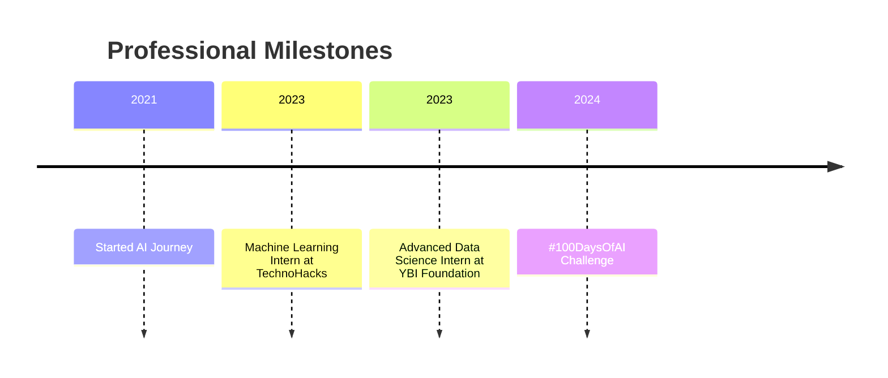

# 🌟 Mahesh Ketam | AI Innovator & Machine Learning Maestro

  
  
  

    
    
    
  

## 💡 Mission Statement

> **Transforming complex data into intelligent solutions, one model at a time. Committed to pushing the boundaries of AI and machine learning to solve real-world challenges.**

## 🌟 About Me

<table>
  <tr>
    <td width="60%">
      
As an AI professional with 3 years of hands-on experience, I'm passionate about developing cutting-edge machine learning models that drive innovation. My journey is fueled by a relentless curiosity to explore the infinite potential of artificial intelligence.

    </td>
    <td width="40%">
      <h3>🎓 Education</h3>
      <ul>
        <li>Bachelor's in Computer Science</li>
        <li>Jayamukhi Institute of Technological Sciences</li>
      </ul>
    </td>
  </tr>
</table>

## 🚀 Quick Glimpse

<table>
  <tr>
    <td width="50%">
      <h3>🎯 Mission</h3>
      
Transforming complex data into intelligent solutions, bridging the gap between artificial intelligence and real-world challenges.

    </td>
    <td width="50%">
      <h3>📊 At a Glance</h3>
      <ul>
        <li>🏆 3+ Years in AI/ML</li>
        <li>🎓 Computer Science Graduate</li>
        <li>🌐 Full-Stack AI Enthusiast</li>
      </ul>
    </td>
  </tr>
</table>

### 🔬 Skill Proficiency

| Skill Category | Proficiency | Highlights |
|---------------|-------------|------------|
| Machine Learning | ███████████████ 90% | NLP, Computer Vision |
| Data Science | ██████████████ 85% | Statistical Analysis, Visualization |
| AI Deployment | ████████████ 75% | Docker, Cloud Platforms |

## 🛠️ Technical Skills Visualization

  

### 🚀 Interactive Timeline

## 💼 Professional Experience

### 🚀 Machine Learning Intern at TechnoHacks
*January 2023 - June 2023*

  
Key Accomplishments

  
  - 📈 Enhanced salary prediction models, improving accuracy by 10%
  - 🤝 Collaborated across teams to integrate AI solutions
  - ⏱️ Reduced processing time by 15% through optimized implementations

### 🌐 Advanced Data Science and AI Intern at YBI Foundation
*July 2023 - December 2023*

  
Key Achievements

  
  - 🎯 Achieved 100% accuracy in iris classification using logistic regression
  - 🍷 Developed wine quality prediction model with 90% accuracy
  - 🔍 Conducted comprehensive model evaluations and performance improvements

## 📦 Featured Projects

  <table>
    <tr>
      <th>Project</th>
      <th>Description</th>
      <th>Technologies</th>
    </tr>
    <tr>
      <td>🤖 Salary Prediction Model</td>
      <td>Machine learning model for accurate salary estimation</td>
      <td>Python, TensorFlow, Scikit-learn</td>
    </tr>
    <tr>
      <td>🍷 Wine Quality Predictor</td>
      <td>Random forest classifier for wine quality assessment</td>
      <td>Python, Scikit-learn, Pandas</td>
    </tr>
  </table>

## 📈 GitHub Stats & Contributions

  
  
  
  

## 🏆 Achievements & Certifications

  <table>
    <tr>
      <th>Achievement</th>
      <th>Description</th>
      <th>Date</th>
    </tr>
    <tr>
      <td>🎯 #100DaysOfAI Challenge</td>
      <td>Completed intensive 100-day AI learning and implementation marathon</td>
      <td>2024</td>
    </tr>
    <tr>
      <td>📚 AI 'Zero to Hero' Course</td>
      <td>Developed and launched comprehensive AI learning program on Teachable.com</td>
      <td>Ongoing</td>
    </tr>
    <tr>
      <td>🤖 Machine Learning Internships</td>
      <td>Successfully completed internships at TechnoHacks and YBI Foundation</td>
      <td>2023</td>
    </tr>
  </table>

## 🏆 Key Achievements Showcase

  <table>
    <tr>
      <td align="center">
        
      </td>
      <td align="center">
        
      </td>
    </tr>
  </table>

## 🌱 Currently Learning

  

Specific Focus Areas:
- Advanced AI techniques and emerging technologies
- Exploring deep learning and advanced machine learning architectures
- Participating in AI research and innovative project developments

## 🎲 Coding Quote

> "In the world of AI, every line of code is a step towards understanding intelligence itself." - Mahesh Ketam

  

## 💬 Let's Connect!

  
**Interested in AI, machine learning, or collaborative innovation? I'm always excited to network and explore groundbreaking ideas!**

  
  
  

---

  
  
  **Thank you for visiting my profile. Stay curious, keep learning!** 😊

